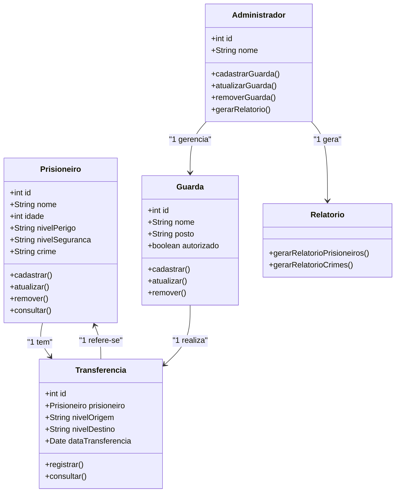
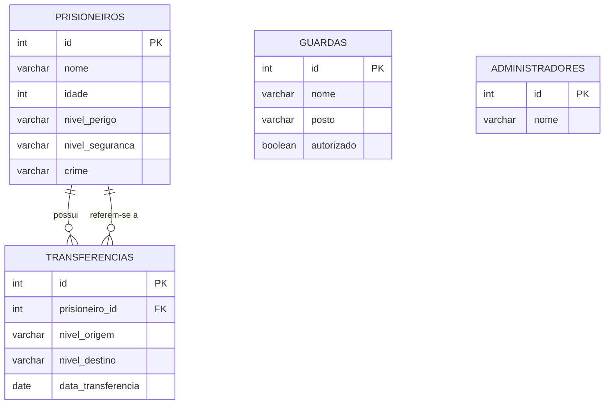

# Impel Down

## Diagrama de Classes

```mermaid
classDiagram
    class Prisioneiro {
        +int id
        +String nome
        +int idade
        +String nivelPerigo
        +String nivelSeguranca
        +String crime
        +cadastrar()
        +atualizar()
        +remover()
        +consultar()
    }

    class Guarda {
        +int id
        +String nome
        +String posto
        +boolean autorizado
        +cadastrar()
        +atualizar()
        +remover()
    }

    class Transferencia {
        +int id
        +Prisioneiro prisioneiro
        +String nivelOrigem
        +String nivelDestino
        +Date dataTransferencia
        +registrar()
        +consultar()
    }

    class Relatorio {
        +gerarRelatorioPrisioneiros()
        +gerarRelatorioCrimes()
    }

    class Administrador {
        +int id
        +String nome
        +cadastrarGuarda()
        +atualizarGuarda()
        +removerGuarda()
        +gerarRelatorio()
    }

    Prisioneiro --> Transferencia : "1 tem"
    Transferencia --> Prisioneiro : "1 refere-se"
    Guarda --> Transferencia : "1 realiza"
    Administrador --> Guarda : "1 gerencia"
    Administrador --> Relatorio : "1 gera"

```

## Modelo Entidade-Relacionamento

```mermaid

erDiagram
    PRISIONEIROS {
        int id PK
        varchar nome
        int idade
        varchar nivel_perigo
        varchar nivel_seguranca
        varchar crime
    }

    GUARDAS {
        int id PK
        varchar nome
        varchar posto
        boolean autorizado
    }

    TRANSFERENCIAS {
        int id PK
        int prisioneiro_id FK
        varchar nivel_origem
        varchar nivel_destino
        date data_transferencia
    }

    ADMINISTRADORES {
        int id PK
        varchar nome
    }

    PRISIONEIROS ||--o{ TRANSFERENCIAS : "possui"
    TRANSFERENCIAS }o--|| PRISIONEIROS : "referem-se a"

```